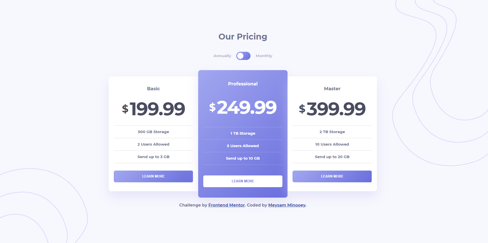

# Frontend Mentor - Pricing component with toggle solution

### The challenge

Users should be able to:

- View the optimal layout for the component depending on their device's screen size
- Control the toggle with both their mouse/trackpad and their keyboard

### Screenshot

### Links

- Solution URL: [Solution URL ](https://your-solution-url.com)
- Live Site URL: [Live site URL ](https://your-live-site-url.com)

### Built with

- Semantic HTML5 markup
- CSS custom properties
- Flexbox
